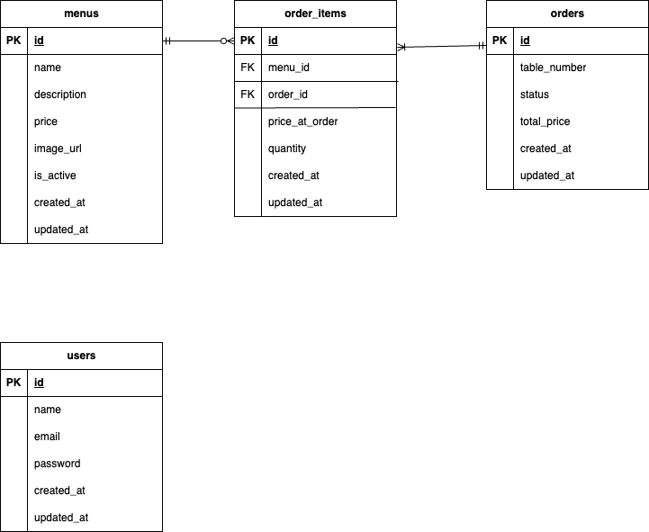

# 飲食店注文アプリ（React × Laravel API）

## 概要
飲食店向けの注文管理アプリです。  
フロントエンドとバックエンドを分離した構成で、API 通信により連携しています。

来店客はスマートフォンから注文を行い、  
管理者は PC からメニュー管理・注文管理を行うことを想定しています。

## リポジトリ構成
- フロントエンド（React）
  https://github.com/risa-prog/restaurant-app-frontend.git
- バックエンド（Laravel API）
  https://github.com/risa-prog/restaurant-app-backend.git

## 使用技術

### フロントエンド
- React
- TypeScript
- Chakra UI

### バックエンド
- Laravel
- Laravel Sanctum（API 認証）

### インフラ
- Docker / Docker Compose

## 環境構築（概要）
1. フロントエンドとバックエンドのリポジトリをクローン
2. バックエンドは Docker を立ち上げて Laravel 環境を構築
3. フロントエンドは npm install して起動
詳細は各リポジトリの README を参照

## 主な機能
- 注文、カート機能
- ユーザー認証（Sanctum）
- 注文管理
- メニュー管理（画像アップロード対応）

## 画面構成（概要）
- テーブル番号選択
- 注文画面（来店客向け）
- 管理画面（管理者向け)

## ローカルでのアクセス URL

- フロントエンド（React 開発サーバー）
  http://localhost:5173
- バックエンド API（Laravel）
  http://localhost:8080
  
## 設計上の工夫
- フロントエンドとバックエンドを完全分離した構成で、画面遷移は素早く、一方でフォーム送信は安全にできる構成にした
- API レスポンスやフォーム入力に対するバリデーションを徹底し、エラーハンドリングも丁寧に実装。  
  フロントからの改竄にも備え、落ちないアプリを意識した
- 本来はテーブル番号をクエリパラメータとして含めたQRコードから注文画面へ直接遷移する運用を想定  
  → 今回は QR コードを用意せず、初回アクセス時にテーブル番号を選択する仕様にして、UXを調整
  
## ER図

